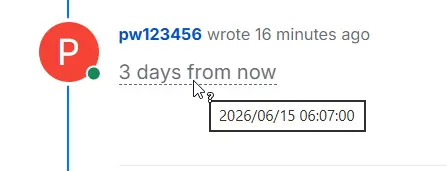
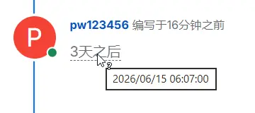

# NodeBB Plugin Timestamp

[](https://opensource.org/licenses/MIT)
[](https://github.com/NodeBB/NodeBB)

在帖子编辑器中插入一个可点击的按钮，方便用户选择日期时间，生成相对时间标记。其他用户看到的是相对时间（如"3 天后"），鼠标悬停即可看到浏览器本地时区的精确时间。

Add a button to the post composer for inserting relative timestamps. Other users see a relative time (e.g. "in 3 days") — hover to reveal the exact time in their local timezone.





---

## Features | 功能

- Composer toolbar button for inserting timestamps
- Datetime picker dialog for easy selection
- Server-side parsing: `[timestamp]1700000000000[/timestamp]` → `<time>` HTML element
- Client-side localization via `toLocaleString()`
- Relative time rendering compatible with NodeBB's built-in timeago
- i18n support (English / 简体中文)

## Installation | 安装

```bash
npm install nodebb-plugin-timestamp
# or via NodeBB ACP plugin manager
```

## Usage | 使用

1. While composing a post, click the clock icon in the editor toolbar.
2. Select a date and time in the picker dialog.
3. A `[timestamp]...[/timestamp]` tag is inserted at the cursor position.
4. After posting, it renders as a relative time. Hover to see the exact time.

## Compatibility | 兼容性

NodeBB v4.12.0+

## Development | 开发

```bash
# Install dependencies
pnpm install

# Dev build with watch
pnpm dev

# Production build
pnpm build

# Type check
pnpm typecheck

# Lint
pnpm lint
```

## License

MIT © [TASA-Ed Studio](https://www.tasaed.top)
